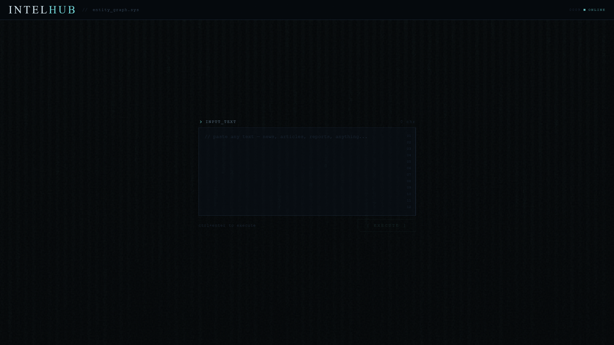
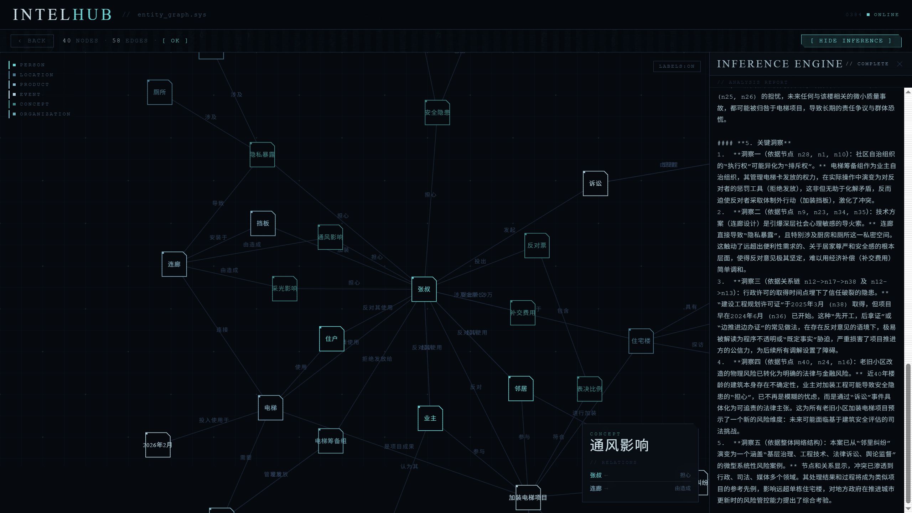

# INTELHUB

**Paste any text. Get an interactive knowledge graph in seconds.**

Built for analysts, journalists, and researchers who need to understand complex entity relationships — without spending 20 minutes drawing them by hand.



---

## What it does

1. **Extract** — Feed it any text (news articles, intelligence reports, research papers). An LLM extracts all entities and relationships automatically.
2. **Visualize** — Renders an interactive force graph. Drag nodes, zoom, click to inspect relationships.
3. **Infer** — Hit the INFERENCE button for a strategic analysis report: power centers, influence paths, hidden patterns, predictions.



Works with any OpenAI-compatible API — DeepSeek, Qwen, GPT-4o, local models via Ollama, etc.

---

## Quick start

**Backend**
```bash
cd backend
cp .env.example .env
# Edit .env — fill in your API key and base URL
pip install -r requirements.txt
uvicorn main:app --reload --port 8000
```

**Frontend**
```bash
cd frontend
cp .env.example .env   # optional: change VITE_API_URL if backend runs elsewhere
bun run dev            # or: npm run dev / npx vite
```

Open `http://localhost:5173`

---

## Configuration

**`backend/.env`**
```env
OPENAI_API_KEY=your-key-here
OPENAI_BASE_URL=https://api.deepseek.com/v1   # any OpenAI-compatible endpoint
OPENAI_MODEL=deepseek-reasoner                # supports R1-style reasoning chains
ALLOWED_ORIGINS=http://localhost:5173         # comma-separated if multiple
```

**`frontend/.env`** (optional)
```env
VITE_API_URL=http://localhost:8000
```

### Tested with
- DeepSeek R1 / V3
- GPT-4o / GPT-4o-mini
- Qwen 2.5

---

## Stack

| Layer | Tech |
|---|---|
| Frontend | React 19 + Vite + D3.js |
| Backend | FastAPI + OpenAI SDK |
| Graph | D3 force simulation |
| Styling | Custom CSS, Share Tech Mono |

---

## License

MIT
